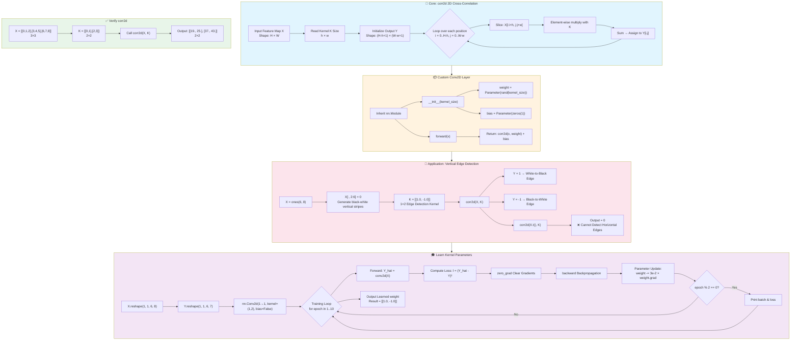

# Convolutional Layer

## Original Code
[main.py](main.py)

## Mermaid Map

```mermaid
flowchart TD
    subgraph Core["🔧 Core: corr2d 2D Cross-Correlation"]
        A["Input Feature Map X<br/>Shape: H × W"] --> B["Read Kernel K Size<br/>h × w"]
        B --> C["Initialize Output Y<br/>Shape: (H-h+1) × (W-w+1)"]
        C --> D{"Loop over each position<br/>i = 0..H-h, j = 0..W-w"}
        D --> E["Slice: X[i:i+h, j:j+w]"]
        E --> F["Element-wise multiply with K"]
        F --> G["Sum → Assign to Y[i,j]"]
        G --> D
    end

    subgraph Verify["✅ Verify corr2d"]
        V1["X = [[0,1,2],[3,4,5],[6,7,8]]<br/>3×3"] --> V2["K = [[0,1],[2,3]]<br/>2×2"]
        V2 --> V3["Call corr2d(X, K)"]
        V3 --> V4["Output: [[19., 25.], [37., 43.]]<br/>2×2"]
    end

    subgraph Layer["📦 Custom Conv2D Layer"]
        L1["Inherit nn.Module"] --> L2["__init__(kernel_size)"]
        L2 --> L3["weight = Parameter(rand(kernel_size))"]
        L2 --> L4["bias = Parameter(zeros(1))"]
        L1 --> L5["forward(x)"]
        L5 --> L6["Return: corr2d(x, weight) + bias"]
    end

    subgraph Edge["🎯 Application: Vertical Edge Detection"]
        E1["X = ones(6, 8)"] --> E2["X[:, 2:6] = 0<br/>Generate black-white vertical stripes"]
        E2 --> E3["K = [[1.0, -1.0]]<br/>1×2 Edge Detection Kernel"]
        E3 --> E4["corr2d(X, K)"]
        E4 --> E5["Y = 1 → White-to-Black Edge"]
        E4 --> E6["Y = -1 → Black-to-White Edge"]
        E4 --> E7["corr2d(X.t(), K)"]
        E7 --> E8["Output ≈ 0<br/>❌ Cannot Detect Horizontal Edges"]
    end

    subgraph Learn["🎓 Learn Kernel Parameters"]
        T1["X.reshape(1, 1, 6, 8)"] --> T2["Y.reshape(1, 1, 6, 7)"]
        T2 --> T3["nn.Conv2d(1→1, kernel=(1,2), bias=False)"]
        T3 --> T4{"Training Loop<br/>for epoch in 1..10"}
        T4 --> T5["Forward: Y_hat = conv2d(X)"]
        T5 --> T6["Compute Loss: l = (Y_hat - Y)²"]
        T6 --> T7["zero_grad Clear Gradients"]
        T7 --> T8["backward Backpropagation"]
        T8 --> T9["Parameter Update:<br/>weight -= 3e-2 × weight.grad"]
        T9 --> T10{"epoch % 2 == 0?"}
        T10 -->|Yes| T11["Print batch & loss"]
        T10 -->|No| T4
        T11 --> T4
        T4 --> T12["Output Learned weight<br/>Result ≈ [[1.0, -1.0]]"]
    end

    Core --> Layer
    Layer --> Edge
    Edge --> Learn

    style Core fill:#e1f5fe
    style Verify fill:#e8f5e9
    style Layer fill:#fff3e0
    style Edge fill:#fce4ec
    style Learn fill:#f3e5f5
```
