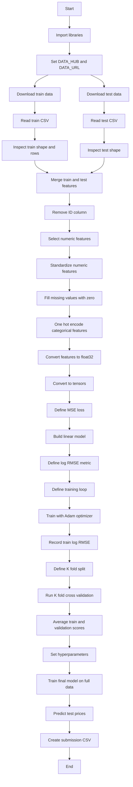

# House Prices - Advanced Regression Techniques

## Original Code
[main.py](main.py)

## Mermaid Map

```mermaid
graph TD
A[Start] --> B[Import libraries]
B --> C[Set DATA_HUB and DATA_URL]
C --> D[Download train data]
C --> E[Download test data]

D --> F[Read train CSV]
E --> G[Read test CSV]
F --> H[Inspect train shape and rows]
G --> I[Inspect test shape]

H --> J[Merge train and test features]
I --> J

J --> K[Remove ID column]
K --> L[Select numeric features]
L --> M[Standardize numeric features]
M --> N[Fill missing values with zero]
N --> O[One hot encode categorical features]
O --> P[Convert features to float32]
P --> Q[Convert to tensors]

Q --> R[Define MSE loss]
R --> S[Build linear model]
S --> T[Define log RMSE metric]
T --> U[Define training loop]
U --> V[Train with Adam optimizer]
V --> W[Record train log RMSE]

W --> X[Define K fold split]
X --> Y[Run K fold cross validation]
Y --> Z[Average train and validation scores]

Z --> AA[Set hyperparameters]
AA --> AB[Train final model on full data]
AB --> AC[Predict test prices]
AC --> AD[Create submission CSV]
AD --> AE[End]
```