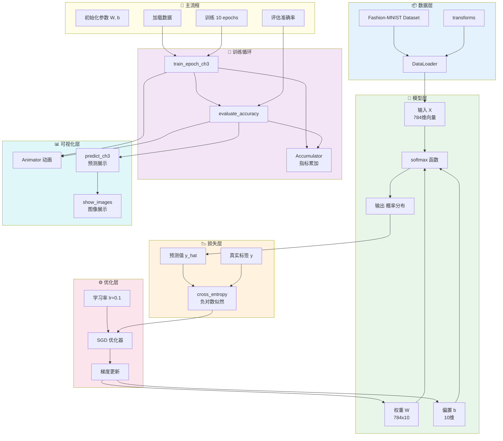
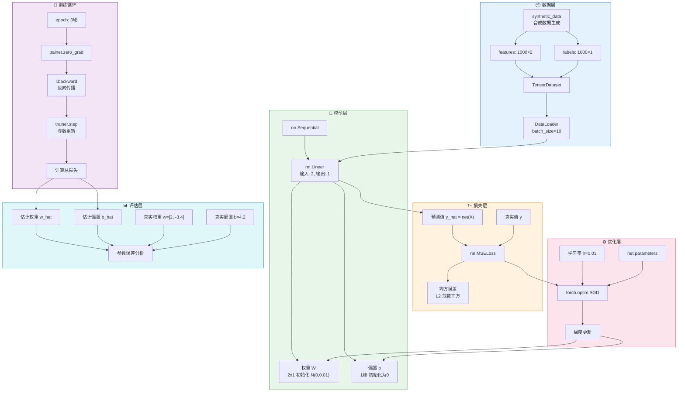

# Softmax Regression

The Model have both [Implementation from Scratch](./softmax_original.py) and [Concise Implementation](./softmax_easy.py)

## Mermaid Map For *Implementation from Scratch*

## Mermaid Map For *Concise Implementation*

